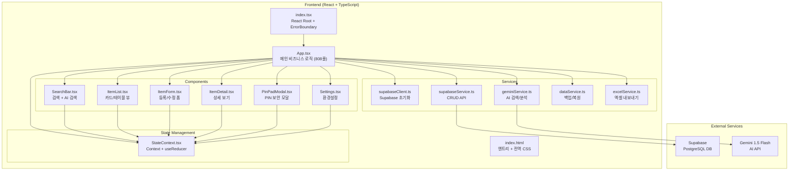
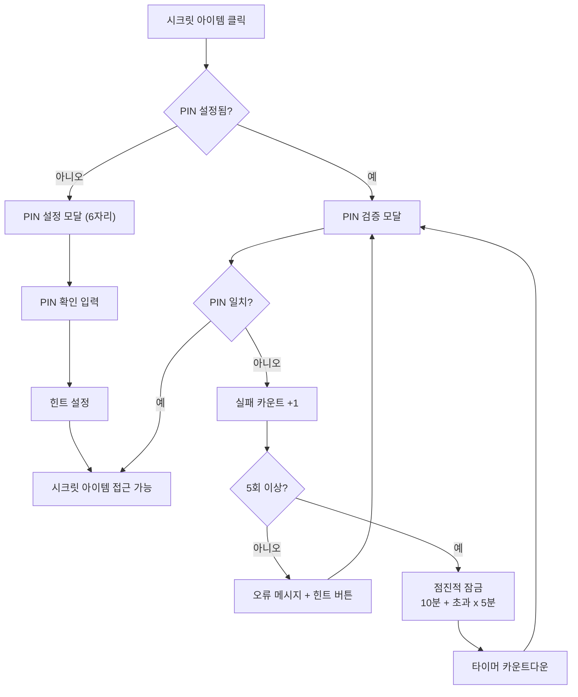
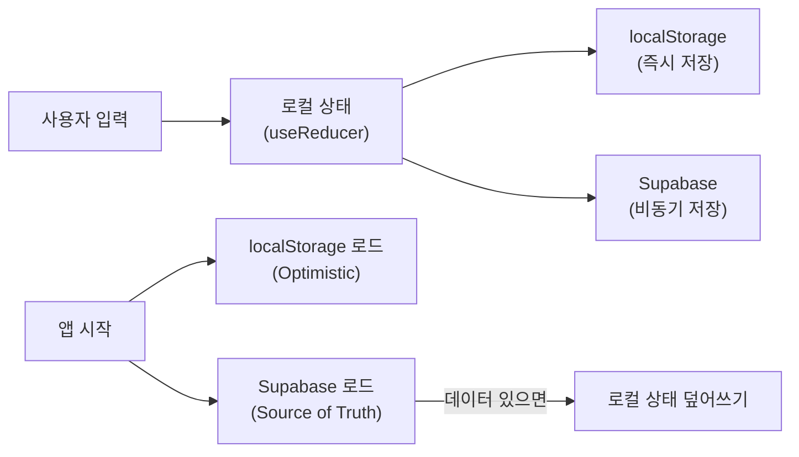

# 📦 WhereIsIt (어딨더라) 프로젝트 전체 분석 보고서

> **분석 일시**: 2026-03-19  
> **프로젝트 버전**: v1.0 (2026-02-20 UI/UX 프리미엄 리디자인 완료 기준)  
> **배포 주소**: [https://jini0107.github.io/memo/](https://jini0107.github.io/memo/)

---

## 1. 프로젝트 개요

**"그거 어디 뒀더라?"** 라는 문제를 해결하기 위한 **개인 물건 위치 관리 웹 애플리케이션**입니다.

| 항목 | 내용 |
|------|------|
| **프로젝트명** | WhereIsIt (어딨더라) |
| **목적** | 물건의 보관 위치를 사진과 함께 기록하고, AI로 검색/자동분류 |
| **기술 스택** | React 19 + TypeScript + Vite + Supabase + Gemini AI |
| **스타일링** | TailwindCSS (CDN) + Vanilla CSS (Glassmorphism) |
| **배포** | GitHub Pages (`gh-pages`) |

---

## 2. 아키텍처 다이어그램



---

## 3. 파일 구조 및 역할 분석

### 📁 루트 설정 파일

| 파일 | 역할 | 비고 |
|------|------|------|
| [package.json](file:///C:/Users/JM2/memo/package.json) | 프로젝트 의존성 및 스크립트 | React 19, Vite 6 사용 |
| [tsconfig.json](file:///C:/Users/JM2/memo/tsconfig.json) | TypeScript 설정 | `bundler` 모듈 해석, `@/*` 경로 별칭 |
| [vite.config.ts](file:///C:/Users/JM2/memo/vite.config.ts) | Vite 빌드 설정 | `base: '/memo/'`, 포트 3000 |
| [.env](file:///C:/Users/JM2/memo/.env) | 환경변수 | Supabase URL/Key, Gemini API Key |
| [.gitignore](file:///C:/Users/JM2/memo/.gitignore) | Git 추적 제외 | [.env](file:///C:/Users/JM2/memo/.env), `node_modules`, `dist` 등 |

### 📁 핵심 소스 코드

| 파일 | 줄 수 | 역할 |
|------|-------|------|
| [index.html](file:///C:/Users/JM2/memo/index.html) | 676줄 | 전역 CSS 시스템 (그라데이션, 글래스, 애니메이션 등) |
| [index.tsx](file:///C:/Users/JM2/memo/index.tsx) | 63줄 | React 루트 마운트 + ErrorBoundary |
| [App.tsx](file:///C:/Users/JM2/memo/App.tsx) | **808줄** | **핵심 비즈니스 로직 통합** (CRUD, PIN, AI 분석 등) |
| [types.ts](file:///C:/Users/JM2/memo/types.ts) | 27줄 | Item, Location, Category 타입 정의 |
| [constants.ts](file:///C:/Users/JM2/memo/constants.ts) | 20줄 | 장소유형, 카테고리 상수 |

### 📁 Components (UI 컴포넌트)

| 파일 | 줄 수 | 역할 |
|------|-------|------|
| [SearchBar.tsx](file:///C:/Users/JM2/memo/components/SearchBar.tsx) | 89줄 | 키워드 검색 + Gemini AI 검색 |
| [ItemList.tsx](file:///C:/Users/JM2/memo/components/ItemList.tsx) | 257줄 | 카드/테이블 뷰 전환, 시크릿 마스킹 |
| [ItemForm.tsx](file:///C:/Users/JM2/memo/components/ItemForm.tsx) | 379줄 | 아이템 등록/수정 폼 (카메라/갤러리 지원) |
| [ItemDetail.tsx](file:///C:/Users/JM2/memo/components/ItemDetail.tsx) | 153줄 | 아이템 상세 정보 표시 |
| [PinPadModal.tsx](file:///C:/Users/JM2/memo/components/PinPadModal.tsx) | 314줄 | 6자리 PIN 입력 (아이폰 스타일) |
| [Settings.tsx](file:///C:/Users/JM2/memo/components/Settings.tsx) | 232줄 | 환경설정 + 데이터 관리 |

### 📁 Services (비즈니스 로직/API)

| 파일 | 줄 수 | 역할 |
|------|-------|------|
| [supabaseClient.ts](file:///C:/Users/JM2/memo/services/supabaseClient.ts) | 27줄 | Supabase 클라이언트 초기화 (실패 시 더미 클라이언트) |
| [supabaseService.ts](file:///C:/Users/JM2/memo/services/supabaseService.ts) | 78줄 | CRUD (fetchItems, addItem, updateItem, deleteItem) |
| [geminiService.ts](file:///C:/Users/JM2/memo/services/geminiService.ts) | 103줄 | AI 이미지 분석, 카테고리 추천, 자연어 검색 |
| [dataService.ts](file:///C:/Users/JM2/memo/services/dataService.ts) | 90줄 | JSON 백업/복원 + 데이터 유효성 검증 |
| [excelService.ts](file:///C:/Users/JM2/memo/services/excelService.ts) | 66줄 | 엑셀(.xlsx) 내보내기 |

### 📁 State Management

| 파일 | 줄 수 | 역할 |
|------|-------|------|
| [StateContext.tsx](file:///C:/Users/JM2/memo/src/context/StateContext.tsx) | 319줄 | Context API + useReducer 상태 관리 |

---

## 4. 핵심 기능 분석

### 🔐 보안 시스템 (시크릿 모드)



- **PIN 관리**: 6자리 숫자, 설정/변경/초기화 지원
- **점진적 잠금**: 5회 실패→10분, 6회 실패→15분, 7회 실패→20분...
- **힌트 시스템**: 1회 이상 실패 시 힌트 보기 버튼 표시
- **마스킹**: 시크릿 아이템은 목록에서 사진/위치/카테고리 전부 은닉

### 📸 이미지 처리

- **2개 슬롯**: 물건 사진 + 보관 장소 사진
- **카메라 직촬**: `capture="environment"` → 모바일 후면 카메라 직접 실행
- **자동 압축**: 400px 리사이즈 + JPEG 60% 품질
- **AI 자동 분석**: 슬롯 0(물건 사진) 업로드 시 Gemini로 자동 인식

### 🤖 AI 기능 (Gemini 1.5 Flash)

| 기능 | 트리거 | 동작 |
|------|--------|------|
| 이미지 분석 | 물건 사진 업로드 시 자동 | 이름, 카테고리, 메모 3개 자동 추천 |
| 이름 기반 추천 | 이름 입력 후 ✨ 버튼 클릭 | 카테고리 + 연관 메모 추천 |
| AI 검색 | 검색창에서 ✨ 버튼 클릭 | 자연어로 관련 물건 필터링 |

### 💾 데이터 저장 전략



> [!IMPORTANT]
> **localStorage 용량 초과 방어가 약합니다.** `QuotaExceededError` 발생 시 console.warn만 출력하고, 이미지 데이터가 많아지면 문제가 될 수 있습니다.

---

## 5. 데이터 모델

### Supabase 테이블 스키마

```sql
create table public.items (
  id text primary key,
  name text not null,
  location_path text,
  category text,
  image_urls text[] default '{}',
  notes text[] default '{}',
  updated_at bigint
);
```

### TypeScript 타입

```typescript
interface Item {
  id: string;
  name: string;
  locationPath: string;       // "집 > 안방" 형태의 표시용 경로
  category: string;           // Category enum 값
  imageUrls: string[];        // Base64 이미지 (최대 2장)
  notes: string[];            // 메모 배열
  updatedAt: number;          // timestamp
  isSecret?: boolean;         // 시크릿 모드 (DB에는 미반영⚠️)
}
```

> [!WARNING]
> `isSecret` 필드가 Supabase 스키마에 없습니다! 현재 시크릿 설정은 **로컬에만 저장**되므로, 다른 기기에서 접속하면 시크릿 정보가 유실됩니다.

---

## 6. UI/UX 디자인 시스템

### 디자인 철학
- **Glassmorphism**: 반투명 배경 + blur 효과
- **인디고 기반 그라데이션**: `#6366f1` → `#a78bfa`
- **바텀시트 모달**: iOS 스타일의 슬라이드업 모달
- **마이크로 애니메이션**: float, bounce-in, fade-in, shake 등

### 커스텀 CSS 클래스 체계

| 카테고리 | 클래스 예시 | 용도 |
|----------|------------|------|
| 그라데이션 | `.gradient-primary`, `.gradient-hero` | 프라이머리 색상 계열 |
| 글래스 | `.glass`, `.glass-strong`, `.glass-dark` | 반투명 효과 |
| 버튼 | `.btn-primary`, `.btn-accent`, `.btn-danger` | CTA 버튼 |
| 카드 | `.card`, `.card-interactive` | 콘텐츠 컨테이너 |
| 인풋 | `.input-field` | 입력 필드 |
| 뱃지 | `.badge-primary`, `.badge-accent` | 태그/라벨 |
| 애니메이션 | `.animate-slide-up`, `.animate-float` | 전환 효과 |

---

## 7. 발견된 이슈 및 개선 포인트

### 🔴 Critical (즉시 수정 권장)

| # | 이슈 | 위치 | 설명 |
|---|------|------|------|
| 1 | **[.env](file:///C:/Users/JM2/memo/.env) 파일에 API 키 노출** | [.env](file:///C:/Users/JM2/memo/.env) | Supabase Key와 Gemini API Key가 평문으로 저장됨. [.gitignore](file:///C:/Users/JM2/memo/.gitignore)에 포함되어 있지만, 실제로 Git에 커밋된 상태인지 확인 필요 |
| 2 | **Supabase RLS 정책이 완전 개방** | [supabase_schema.sql](file:///C:/Users/JM2/memo/supabase_schema.sql) | `using (true) with check (true)` → 누구나 읽기/쓰기 가능 |
| 3 | **isSecret 필드가 DB에 없음** | [supabaseService.ts](file:///C:/Users/JM2/memo/services/supabaseService.ts) | insert/update 시 `isSecret`을 전송하지 않아 클라우드 동기화 시 시크릿 설정 손실 |

### 🟡 Major (조기 개선 권장)

| # | 이슈 | 위치 | 설명 |
|---|------|------|------|
| 4 | **App.tsx 808줄 단일 파일** | [App.tsx](file:///C:/Users/JM2/memo/App.tsx) | 모든 비즈니스 로직이 한 파일에 집중. Custom Hooks 분리 시도했으나 롤백됨 |
| 5 | **localStorage 용량 초과 방어 미흡** | `StateContext.tsx:290` | 이미지 Base64 데이터가 누적되면 용량 초과 발생 가능 |
| 6 | **PIN이 평문으로 localStorage에 저장** | `StateContext.tsx:306` | 해시 처리 없이 원본 PIN 저장 |
| 7 | **이미지가 Base64로 DB에 직접 저장** | [supabaseService.ts](file:///C:/Users/JM2/memo/services/supabaseService.ts) | Supabase Storage 미사용. DB row 크기 폭증 위험 |

### 🟢 Minor (향후 개선)

| # | 이슈 | 위치 | 설명 |
|---|------|------|------|
| 8 | 디버그 console.log 다수 잔류 | `StateContext.tsx:141-144` | `UPDATE_FORM` 액션에 로그 3줄 |
| 9 | [handoff_memo.txt](file:///C:/Users/JM2/memo/handoff_memo.txt)에 TailwindCSS 언급 | `handoff_memo.txt:19` | 실제로는 CDN TailwindCSS + Vanilla CSS 혼용 |
| 10 | [.env](file:///C:/Users/JM2/memo/.env) 키 이름 불일치 | [.env](file:///C:/Users/JM2/memo/.env) vs [supabaseClient.ts](file:///C:/Users/JM2/memo/services/supabaseClient.ts) | [.env](file:///C:/Users/JM2/memo/.env)는 `VITE_SUPABASE_KEY`, 문서는 `VITE_SUPABASE_ANON_KEY` |

---

## 8. 의존성 분석

### Production Dependencies

| 패키지 | 버전 | 용도 |
|--------|------|------|
| `react` | ^19.2.3 | UI 프레임워크 |
| `react-dom` | ^19.2.3 | DOM 렌더링 |
| `@supabase/supabase-js` | ^2.95.3 | Supabase 클라이언트 |
| `@google/genai` | ^1.42.0 | Gemini AI API |
| `xlsx` | ^0.18.5 | 엑셀 파일 생성 |

### Dev Dependencies

| 패키지 | 버전 | 용도 |
|--------|------|------|
| `vite` | ^6.2.0 | 빌드 도구 |
| `@vitejs/plugin-react` | ^5.0.0 | React Fast Refresh |
| `typescript` | ~5.8.2 | 타입 체크 |
| `gh-pages` | ^6.3.0 | GitHub Pages 배포 |
| `@types/node` | ^22.14.0 | Node.js 타입 |

> [!NOTE]
> TailwindCSS는 CDN으로 로드(`index.html:33`)되어 있어 [package.json](file:///C:/Users/JM2/memo/package.json)에는 포함되지 않습니다.

---

## 9. 프로젝트 현황 (TASK_CHECKLIST 기준)

### ✅ 완료

- UI/UX 2.0 프리미엄 리디자인
- 6자리 PIN 보안 시스템
- Supabase 클라우드 동기화
- GitHub Pages 배포
- 시크릿 PIN 관리 (변경/초기화)
- 점진적 보안 잠금 시스템
- README 통합 가이드

### ⬜ 미완료

- localStorage 용량 초과 방지 보완
- 대용량 이미지 등록 시 성능 최적화
- Gemini 3.1 Pro 모델 연결 확인

---

## 10. 총평

잘 만들어진 모바일 퍼스트 웹 앱입니다! UI/UX 디자인이 상당히 세련되고, AI 기능 연동도 잘 구현되어 있습니다. 다만 **보안(PIN 평문 저장, RLS 개방)**, **확장성(App.tsx 단일 파일)**, **데이터 관리(Base64 이미지 직접 저장)** 측면에서 개선 여지가 있습니다.

어떤 작업부터 진행할지 말씀해 주세요! 🚀
